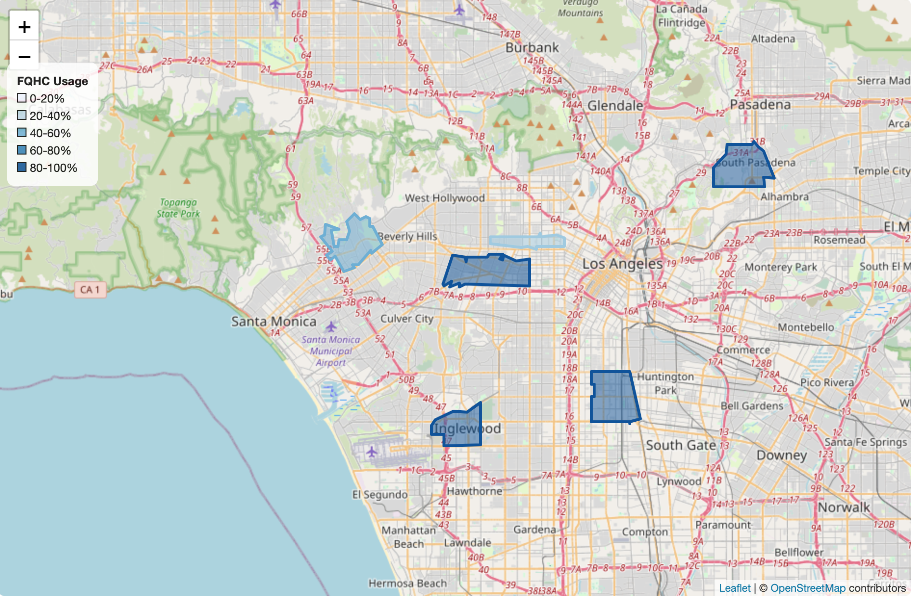
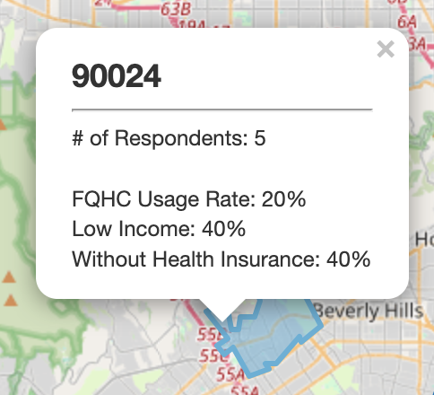
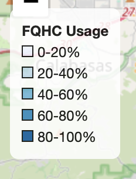
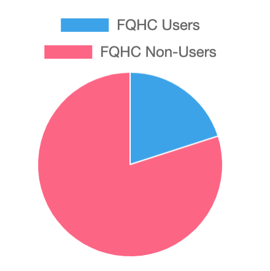
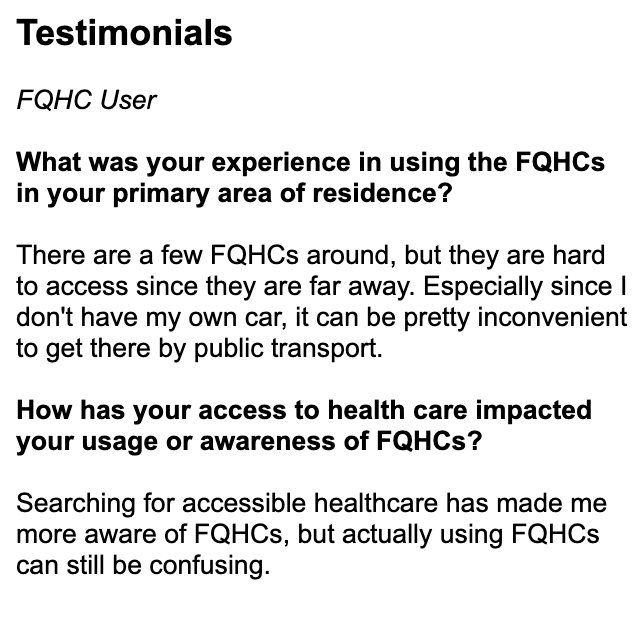

# FQH-Seeing Health Access for Bruins
> We are a group of UCLA undergraduate students interested in exploring the effects of FQHCs in the UCLA community. Through our survey and map, we aim to measure the awareness and use of FQHCs among undergraduate students in the UCLA community in order to visualize potential areas of change for the community to better utilize FQHC resources.
> Live demo [_here_](https://jamesfalkenroth.github.io/healthcare/index.html). <!-- If you have the project hosted somewhere, include the link here. -->

## Table of Contents
* [Objective](#objective)
* [Empowerment](#empowerment)
* [Technology Used](#technology-used)
* [Future Applications](#future-applications)
* [Features](#features)

## Objective

We plan to use our mapplication to help provide locations and information on federally qualified healthcare centers in local areas. Our mapplication will empower people who are unable to pay for medical services due to lack of funds and/or lack of health insurance coverage by addressing the social problem of the lack of affordable healthcare options, especially for people in low-income communities. In making our mapplication, we need to consider accessibility (based on language and technology) of our application and may need to perform further research on the true effectiveness of federally qualified healthcare centers for low income populations.

## Empowerment

Our technology provides a platform for the UCLA community to share stories and experiences about FQHCs and helps to aggregate stories and statistics about FQHC usage in the primary areas of residence of UCLA students.

## Technology Used

In our project, we used HTML to create a framework for our website, CSS to style our design, and JavaScript to add functionality to our html elements. We incorporated the JavaScript packages [Leaflet.js](https://leafletjs.com/) and [turf.js](https://turfjs.org/) to add functional maps which helped to support our goal to visuallly represent community stories. We collected survey information through a Google Form embedded in our website, and we analyzed data from automatically generated Google Sheets using Google Scripts to Geocode the latitude and longitude coordinates from submitted locations.

## Future Applications

For future projects, our project could be expanded to different or larger target populations of low income individuals or those without health insurance to showcase community information on the awareness and usage of FQHCs. Additionally, our code could be referenced or applied toward collecting and showing any location-specific community stories and experiences while providing aggregated statistical analysis based on region. The code could be adapted to collecting different information through different Google forms either within our outside of the UCLA community.

## Features

### Map

Our map highlight zip codes based on levels of FQHC usage in user responses.

### Pop-Up

When users select any highlighted region on the map, a pop-up appears highlighting FQHC usage rate, health insurance demographics, and low-income rate corresponding to that region.

### Legend

The legend defines the range of FQHC usage rates corresponding to each color on the map.

### Survey Button

The survey button allows users to share their own stories by filling out our survey.

### Pie Chart

The pie chart visually displays the proportion of FQHC users in a region

### Testimonials

For community members in each region, stories on FQHCs and healthcare access are displayed.